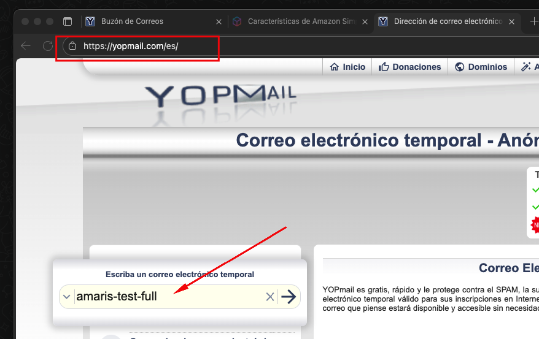
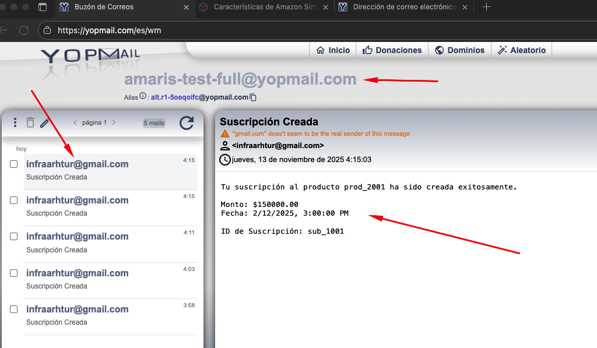
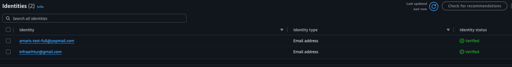
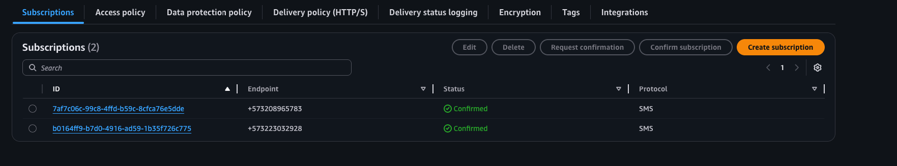
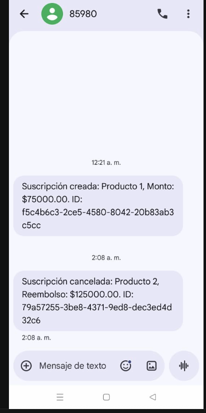

# Guía del Proyecto

Este repositorio corresponde a la prueba técnica de Amaris desarrollada en .NET.  
En las secciones siguientes encontrarás información sobre la arquitectura del proyecto, buenas prácticas implementadas, configuración necesaria para aplicar migraciones automáticas, ejecutar pruebas unitarias y generar reportes de cobertura.

---

## 📐 Arquitectura del Proyecto

Este proyecto implementa una **arquitectura limpia (Clean Architecture)** combinada con principios de **Domain-Driven Design (DDD)** y **Arquitectura Hexagonal**, siguiendo las mejores prácticas de desarrollo de software empresarial.

### Estructura en Capas

El proyecto está organizado en las siguientes capas, siguiendo el principio de **dependencia inversa** (las capas externas dependen de las internas, nunca al revés):

```
TechnicalTest.Solution.sln
├── TechnicalTest.Domain/          # Capa de Dominio (Núcleo)
├── TechnicalTest.Application/     # Capa de Aplicación
├── TechnicalTest.Infrastructure/  # Capa de Infraestructura
└── TechnicalTest.Api/             # Capa de Presentación
```

#### 1. **Domain Layer** (`TechnicalTest.Domain`)
La capa más interna, completamente independiente de frameworks y tecnologías externas.

- **Entidades de Dominio**: Contienen la lógica de negocio y reglas del dominio
  - `Client`: Gestiona saldo, validaciones y operaciones de débito/crédito
  - `Product`: Representa productos financieros con validaciones de negocio
  - `Subscription`: Maneja el ciclo de vida de suscripciones
  - `User`, `BankBranch`, `Availability`, `Schedule`
  
- **Características DDD**:
  - **Entidades ricas**: Contienen lógica de negocio (ej: `Client.Debit()`, `Client.Credit()`, `Subscription.Cancel()`)
  - **Encapsulación**: Propiedades con setters privados, métodos públicos para modificar estado
  - **Validaciones de dominio**: Reglas de negocio validadas en el dominio (ej: saldo insuficiente, monto mínimo)
  - **Excepciones de dominio**: `DomainException`, `NotFoundException` para errores de negocio
  - **Value Objects**: Preparado para encapsular conceptos del dominio
  - **Enums**: `ProductCategory`, `NotificationChannel`

- **Principios aplicados**:
  - ✅ No depende de ninguna otra capa
  - ✅ No tiene referencias a frameworks externos
  - ✅ Lógica de negocio encapsulada en las entidades

#### 2. **Application Layer** (`TechnicalTest.Application`)
Contiene la lógica de casos de uso y orquesta las operaciones del dominio.

- **Servicios de Aplicación**: Implementan casos de uso específicos
  - `ProductManagementService`: Gestión de productos y suscripciones
  - `ClientService`: Operaciones sobre clientes
  - `AuthService`: Autenticación y autorización
  - `BankBranchService`, `AvailabilityService`, `ScheduleService`

- **Interfaces (Puertos - Arquitectura Hexagonal)**:
  - `IProductManagementService`, `IClientService`, `IAuthService`, etc.
  - `INotificationService`: Contrato para notificaciones
  - `IEventBridgeService`: Contrato para publicación de eventos
  - Repositorios: `IClientRepository`, `IProductRepository`, `ISubscriptionRepository`, etc.

- **DTOs**: Objetos de transferencia de datos para comunicación entre capas
- **Mappers**: Transformación entre entidades de dominio y DTOs

- **Principios aplicados**:
  - ✅ Depende solo de `Domain`
  - ✅ Define contratos (interfaces) que implementa `Infrastructure`
  - ✅ Orquesta operaciones de dominio y coordina servicios

#### 3. **Infrastructure Layer** (`TechnicalTest.Infrastructure`)
Implementa los detalles técnicos y adaptadores externos.

- **Persistence**: Implementación de repositorios con Entity Framework Core
  - `AppDbContext`: Contexto de base de datos PostgreSQL
  - Repositorios: `ClientRepository`, `ProductRepository`, `SubscriptionRepository`, etc.
  
- **Authentication**: Implementación de JWT y hashing de contraseñas
  - `JwtProvider`: Generación y validación de tokens JWT
  - `PasswordHasher`: Hashing seguro de contraseñas

- **DependencyInjection**: Configuración de servicios y dependencias

- **Principios aplicados**:
  - ✅ Implementa interfaces definidas en `Application`
  - ✅ Maneja detalles técnicos (ORM, autenticación, etc.)
  - ✅ Depende de `Domain` y `Application`

#### 4. **API Layer** (`TechnicalTest.Api`)
Capa de presentación que expone los endpoints HTTP.

- **Controllers**: Endpoints RESTful
  - `AuthController`: Autenticación y registro
  - `ProductsController`: Gestión de productos
  - `SubscriptionsController`: Operaciones de suscripciones
  - `ClientController`, `BankBranchController`, `AvailabilityController`, `ScheduleController`

- **Services**: Adaptadores para servicios externos
  - `EventBridgeService`: Implementación de publicación de eventos a AWS EventBridge
  - `NotificationService`: Servicio de notificaciones

- **Configuración**:
  - Swagger/OpenAPI para documentación
  - JWT Authentication
  - Health Checks
  - Manejo global de excepciones

- **Principios aplicados**:
  - ✅ Depende de `Application` e `Infrastructure`
  - ✅ Orquesta la ejecución de casos de uso
  - ✅ Maneja HTTP, serialización, autenticación

---

## 🎯 Principios y Buenas Prácticas Implementadas

### Clean Architecture
- ✅ **Separación de responsabilidades**: Cada capa tiene una responsabilidad clara
- ✅ **Independencia de frameworks**: El dominio no depende de tecnologías específicas
- ✅ **Testabilidad**: Fácil de testear gracias a la inyección de dependencias
- ✅ **Independencia de UI**: La lógica de negocio no depende de cómo se expone (API, CLI, etc.)
- ✅ **Independencia de base de datos**: El dominio no conoce detalles de persistencia

### Domain-Driven Design (DDD)
- ✅ **Entidades ricas**: La lógica de negocio vive en las entidades del dominio
- ✅ **Lenguaje ubicuo**: Nombres que reflejan el dominio del negocio
- ✅ **Validaciones en el dominio**: Las reglas de negocio se validan donde deben estar
- ✅ **Excepciones de dominio**: Errores de negocio claramente diferenciados
- ✅ **Encapsulación**: El estado solo se modifica a través de métodos del dominio

**Ejemplo de entidad rica**:
```csharp
// Client.cs - La lógica de negocio está en el dominio
public void Debit(decimal amount, string? productName = null)
{
    ValidateAmount(amount);
    if (Balance < amount)
    {
        throw new DomainException($"No tiene saldo disponible para vincularse al producto {productName}.");
    }
    Balance -= amount;
}
```

### Arquitectura Hexagonal (Ports & Adapters)
- ✅ **Puertos (Ports)**: Interfaces definidas en `Application` (ej: `INotificationService`, `IEventBridgeService`)
- ✅ **Adaptadores (Adapters)**: Implementaciones en `Infrastructure` y `Api`
- ✅ **Desacoplamiento**: El núcleo de la aplicación no conoce detalles de implementación
- ✅ **Intercambiabilidad**: Fácil cambiar implementaciones (ej: cambiar EventBridge por otro sistema de eventos)

### SOLID Principles
- ✅ **Single Responsibility**: Cada clase tiene una única razón para cambiar
- ✅ **Open/Closed**: Abierto a extensión, cerrado a modificación
- ✅ **Liskov Substitution**: Las implementaciones son intercambiables
- ✅ **Interface Segregation**: Interfaces específicas y cohesivas
- ✅ **Dependency Inversion**: Dependencias hacia abstracciones, no implementaciones

### Otras Buenas Prácticas
- ✅ **Inyección de dependencias**: Todo se inyecta a través del constructor
- ✅ **Async/Await**: Operaciones asíncronas para mejor rendimiento
- ✅ **Cancellation Tokens**: Soporte para cancelación de operaciones
- ✅ **Logging estructurado**: Uso de `ILogger` para trazabilidad
- ✅ **Manejo de excepciones**: Manejo centralizado con `UseExceptionHandler`
- ✅ **Health Checks**: Monitoreo de salud de la aplicación
- ✅ **TimeProvider**: Abstracción del tiempo para testabilidad

---

## 📡 Patrón de Eventos (Event-Driven Architecture)

El proyecto implementa un **patrón de eventos** utilizando **AWS EventBridge** para desacoplar la publicación de eventos de su procesamiento, siguiendo principios de arquitectura orientada a eventos.

### Arquitectura de Eventos

```
┌─────────────────┐
│  Application    │
│    Service      │
└────────┬────────┘
         │
         │ NotifyAsync()
         ▼
┌─────────────────┐
│ Notification    │
│    Service      │
└────────┬────────┘
         │
         │ PublishEventAsync()
         ▼
┌─────────────────┐         ┌──────────────┐
│ EventBridge     │────────▶│ AWS          │
│    Service      │         │ EventBridge  │
└─────────────────┘         └──────┬───────┘
                                    │
                                    │ Eventos
                                    ▼
                           ┌─────────────────┐
                           │ Lambda Function │
                           │ (Procesamiento) │
                           └─────────────────┘
```

### Eventos Implementados

#### 1. **SubscriptionCreatedEvent**
Se publica cuando un cliente se suscribe a un producto.

**Datos del evento**:
- `subscriptionId`: Identificador único de la suscripción
- `productId`: ID del producto
- `clientId`: ID del cliente
- `customerEmail`: Email del cliente
- `customerPhone`: Teléfono del cliente
- `amount`: Monto de la suscripción
- `subscribedAtUtc`: Fecha y hora de suscripción (UTC)

**Flujo**:
1. El cliente se suscribe a un producto (`ProductManagementService.SubscribeAsync()`)
2. Se actualiza el saldo del cliente
3. Se crea la suscripción en la base de datos
4. Se publica el evento `SubscriptionCreatedEvent` a EventBridge
5. Una Lambda procesa el evento y envía notificaciones (SMS/Email)

#### 2. **SubscriptionCancelledEvent**
Se publica cuando se cancela una suscripción.

**Datos del evento**:
- `subscriptionId`: Identificador único de la suscripción
- `productId`: ID del producto
- `clientId`: ID del cliente
- `customerEmail`: Email del cliente
- `customerPhone`: Teléfono del cliente
- `amount`: Monto a reembolsar
- `cancelledAtUtc`: Fecha y hora de cancelación (UTC)

**Flujo**:
1. Se cancela la suscripción (`ProductManagementService.CancelSubscriptionAsync()`)
2. Se actualiza el estado de la suscripción
3. Se reembolsa el saldo al cliente
4. Se publica el evento `SubscriptionCancelledEvent` a EventBridge
5. Una Lambda procesa el evento y envía notificaciones (SMS/Email)

### Implementación Técnica

#### Interface (Puerto)
```csharp
// Application/Interfaces/IEventBridgeService.cs
public interface IEventBridgeService
{
    Task PublishSubscriptionCreatedEventAsync(...);
    Task PublishSubscriptionCancelledEventAsync(...);
}
```

#### Implementación (Adaptador)
```csharp
// Api/Services/EventBridgeService.cs
public class EventBridgeService : IEventBridgeService
{
    // Publica eventos a AWS EventBridge usando AmazonEventBridgeClient
}
```

### Beneficios del Patrón de Eventos

1. **Desacoplamiento**: La lógica de negocio no depende de cómo se procesan las notificaciones
2. **Escalabilidad**: El procesamiento de eventos puede escalar independientemente
3. **Resiliencia**: Si el procesamiento falla, el evento se puede reintentar
4. **Extensibilidad**: Fácil agregar nuevos consumidores de eventos sin modificar el código existente
5. **Asincronía**: Las notificaciones no bloquean la operación principal
6. **Trazabilidad**: Los eventos quedan registrados en EventBridge para auditoría

### Configuración

Los eventos se configuran en `appsettings.json`:

```json
{
  "AWS": {
    "Region": "us-east-1",
    "EventBridge": {
      "EventBusName": "technicaltest-eventbus"
    }
  }
}
```

---

## 🚀 Configuración y Uso

### 1. Configuración de `TechnicalTest.Api`

Para asegurarte de que la base de datos se migre cada vez que se construye o publica el proyecto, el siguiente bloque ya está configurado en `Program.cs`:

```csharp
var app = builder.Build();

using (var scope = app.Services.CreateScope())
{
    var dbContext = scope.ServiceProvider.GetRequiredService<AppDbContext>();
    dbContext.Database.Migrate();
}
```

### 2. Pruebas unitarias

- **Ejecutar todas las pruebas**

  ```bash
  dotnet test
  ```

- **Ejecutar pruebas filtradas**

  ```bash
  dotnet test --filter subscriptions
  ```

### 3. Reportes de cobertura

#### 3.1 Generar reporte en formato XML

```bash
dotnet test /Users/arhtur/pruebaTecnicaAmaris/TechnicalTest.Solution.sln \
  --collect:"XPlat Code Coverage" \
  --results-directory /Users/arhtur/pruebaTecnicaAmaris/test/TestResults \
  -- DataCollectionRunSettings.DataCollectors.DataCollector.Configuration.Format=cobertura
```

#### 3.2 Instalar el generador de reportes HTML

```bash
dotnet tool install --global dotnet-reportgenerator-globaltool
```

#### 3.3 Generar reporte en formato HTML

```bash
reportgenerator \
  "-reports:/Users/arhtur/pruebaTecnicaAmaris/test/TestResults/**/coverage.cobertura.xml" \
  "-targetdir:/Users/arhtur/pruebaTecnicaAmaris/test/TestResults/CoverageReport" \
  "-reporttypes:Html"
```

### 4. Integración continua (CI) con GitHub Actions

- Este repositorio cuenta con un workflow básico en `.github/workflows/dotnet-ci.yml` que se ejecuta en cada `push` o `pull_request` hacia `main`.
- El pipeline realiza los pasos `dotnet restore`, `dotnet build --configuration Release` y `dotnet test --configuration Release --collect:"XPlat Code Coverage"`.
- Puedes revisar las ejecuciones desde la pestaña **Actions** del repositorio en GitHub y usarlo como base para agregar tareas adicionales (linters, build de contenedores, despliegues, etc.).

### 5. Configuración de Correo Temporal para Pruebas

Para el envío exitoso de correos durante las pruebas y validación de notificaciones, se debe configurar un correo temporal utilizando el servicio **YOPmail**.



#### Configuración del Correo Temporal

1. **Accede al servicio YOPmail:**
   - URL: <https://yopmail.com/es/>

2. **Ingresa el correo temporal recomendado:**
   - Correo: `amaris-test-full`
   - El correo completo será: `amaris-test-full@yopmail.com`

3. **Accede al buzón:**
   - Haz clic en el botón de verificación (flecha derecha) para acceder al buzón
   - El correo estará disponible y accesible sin necesidad de registro

4. **Verificar el envío de correos:**
   - Para verificar que el envío de email se realiza correctamente, haz clic en el botón **Actualizar** (refresh) en el buzón de YOPmail
   - Los correos de notificación aparecerán en la lista del buzón



#### Uso del Correo Temporal

Este correo temporal es útil para:
- ✅ Pruebas de envío de notificaciones por email
- ✅ Validación de eventos de suscripción (`SubscriptionCreatedEvent`)
- ✅ Validación de eventos de cancelación (`SubscriptionCancelledEvent`)
- ✅ Testing de integración con servicios de notificación

#### Configuración Automática del Email en Clientes

> **⚠️ Aclaración importante para el envío de emails:**  
> Para que los emails lleguen correctamente, **los clientes deben crearse con el correo `amaris-test-full@yopmail.com`**. El sistema utilizará automáticamente este correo si no se proporciona un email o si el email proporcionado está vacío. Esto es necesario porque **Amazon SES no permite enviar correos a emails no verificados**, y este correo temporal está registrado y verificado para las pruebas.



Los siguientes emails están actualmente verificados en Amazon SES:
- `amaris-test-full@yopmail.com` - Email temporal para pruebas (usar este correo al crear clientes)
- `infraarhtur@gmail.com` - Email de infraestructura

> **Nota:** Puedes encontrar más detalles sobre la configuración en el archivo `scripts/configuracion_correo_temporal.md`.

### 6. Configuración de Servicio de Mensajería SMS

Para el envío exitoso de notificaciones SMS, se configuraron números de teléfono de prueba que están suscritos al servicio de Amazon SNS (Simple Notification Service).



#### Números de Prueba Inscritos

Los siguientes números de teléfono están actualmente suscritos y confirmados en Amazon SNS:
- `+573208965783` - Número de prueba 1
- `+573223032928` - Número de prueba 2

Estos números están configurados para recibir notificaciones SMS cuando se crean o cancelan suscripciones a productos.

#### CRUD de Suscripciones SMS

El sistema incluye un CRUD completo para gestionar suscripciones de números telefónicos al servicio de notificaciones SMS:

- **Crear suscripción** (`POST /api/sns/subscribe`): Suscribe un número de teléfono al topic SNS para recibir notificaciones SMS
- **Listar suscripciones** (`GET /api/sns/subscriptions`): Obtiene todas las suscripciones activas del topic SNS
- **Eliminar suscripción** (`DELETE /api/sns/subscriptions/{subscriptionArn}`): Cancela una suscripción SNS específica

#### Verificación de Envío de SMS

El sistema está configurado correctamente y los mensajes SMS se están enviando exitosamente. A continuación se muestra un ejemplo de los mensajes recibidos:



Los mensajes SMS incluyen información sobre:
- **Suscripciones creadas**: Producto, monto y ID de suscripción
- **Suscripciones canceladas**: Producto, monto de reembolso e ID de suscripción

> **⚠️ Consideraciones importantes sobre la entrega de SMS:**
> - La llegada de los mensajes SMS puede verse afectada por el **número de envíos diarios** permitidos por el servicio
> - La entrega también depende de que **no haya bloqueos por parte del operador** al número que envía los mensajes
> - Para que los SMS lleguen correctamente, los números telefónicos deben estar suscritos y confirmados en Amazon SNS
> - El proceso de suscripción se realiza a través del endpoint `POST /api/sns/subscribe`

---

## 🌐 Despliegue en AWS

El proyecto está desplegado en una instancia EC2 de AWS y está disponible públicamente.

### URL del Despliegue

- **API Base:** http://44.223.40.48:8080
- **Swagger UI:** http://44.223.40.48:8080/swagger/index.html

### Acceso a la Documentación de la API

Puedes acceder a la documentación interactiva de la API a través de Swagger UI en la siguiente URL:

🔗 [http://44.223.40.48:8080/swagger/index.html](http://44.223.40.48:8080/swagger/index.html)

Desde Swagger UI puedes:
- ✅ Explorar todos los endpoints disponibles
- ✅ Ver los modelos de datos (DTOs)
- ✅ Probar los endpoints directamente desde el navegador
- ✅ Autenticarte usando JWT para acceder a endpoints protegidos

> **Nota:** Para más detalles sobre el proceso de despliegue en EC2 con Docker Compose, consulta el archivo `README2.md` que contiene la documentación completa del proceso de despliegue.

---

## 📚 Comandos útiles de .NET

- `dotnet build` - Compilar el proyecto
- `dotnet run` - Compilar y ejecutar
- `dotnet restore` - Restaurar paquetes NuGet
- `dotnet clean` - Limpiar archivos de compilación
- `dotnet test` - Ejecutar tests

---

## 🔗 Referencias

- [Clean Architecture by Robert C. Martin](https://blog.cleancoder.com/uncle-bob/2012/08/13/the-clean-architecture.html)
- [Domain-Driven Design](https://martinfowler.com/bliki/DomainDrivenDesign.html)
- [Hexagonal Architecture (Ports & Adapters)](https://alistair.cockburn.us/hexagonal-architecture/)
- [AWS EventBridge Documentation](https://docs.aws.amazon.com/eventbridge/)
